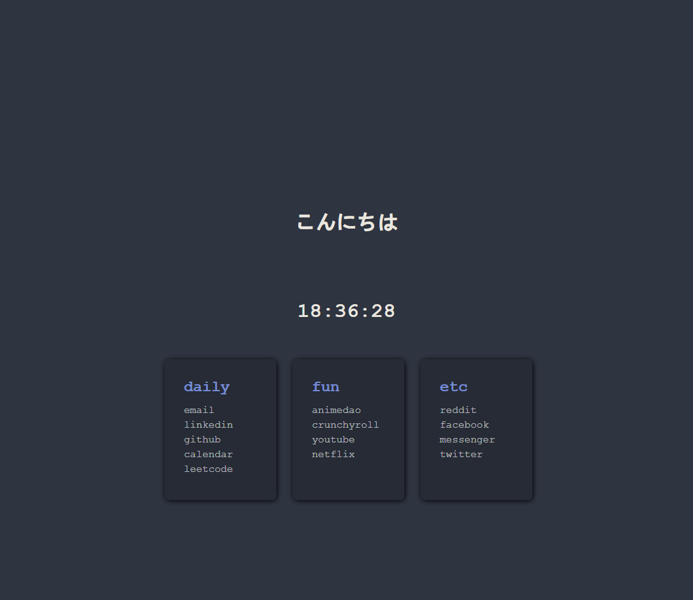

# Homepage

## Description
Here's simple homepage with links that I frequent!
A lot of things are to be added soon.

## Preview
Should look something like this


## Installation
In a CLI, run the command:
```
git clone https://github.com/apollotruong/homepage.git
```

## Usage
Navigate to your browser (Firefox/Chrome) and set your homepage to:
(I downloaded to my Documents folder)
```
C:\Users\Admin\Documents\homepage\index.html
```

## TODO!

Toggle brightness

Toggle a theme

flexing
